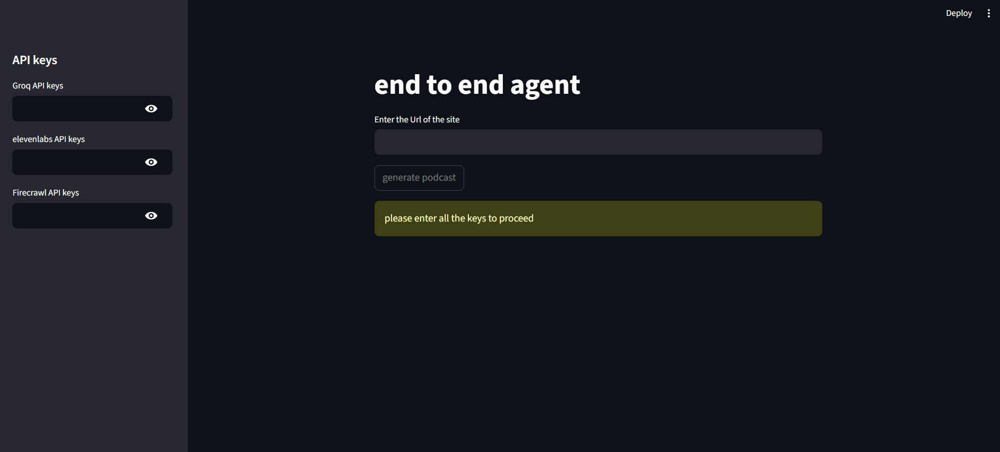
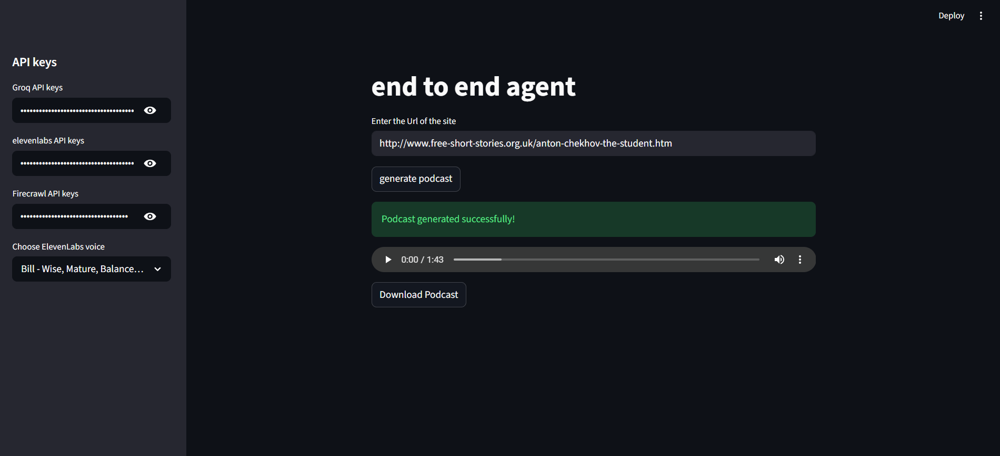

<div align="center">
# 🎙️ Article to Podcast Generator

A free, end-to-end AI app that turns any blog post or article URL into a downloadable podcast audio file — no paid APIs required.


🌐 **Live Site → [5mftrnudx9kaescr3zqivz.streamlit.app](https://5mftrnudx9kaescr3zqivz.streamlit.app/)**

</div>

---

## What It Does
You paste a URL → the app scrapes it, summarizes it, and converts it to speech. That's it. You get a playable, downloadable MP3 in under 30 seconds.

---

<!-- <div align="center">

<h2>Demo Video</h2>

<a href="https://your-video-link.com">
</a>

--- -->

## 📸 Screenshots

### Home Page


### gen podcast


<!-- ### Playlist View


### Real-Time Chat


### Admin Dashboard
 -->

</div>

---

## How It Works

1. **Firecrawl** scrapes the article content from the URL you provide
2. **Groq (LLaMA 3.3 70B)** summarizes it into a short, conversational podcast script
3. **ElevenLabs** converts the summary into natural-sounding audio
4. The audio plays directly in the browser and can be downloaded as an MP3

---

## 🛠️ Tech Stack

| Tool | Purpose | Free? |
|---|---|---|
| [Streamlit](https://streamlit.io) | Web UI | Yes |
| [Groq](https://console.groq.com) | LLM summarization (LLaMA 3.3 70B) | Yes |
| [ElevenLabs](https://elevenlabs.io) | Text to speech | 10k chars/month |
| [Firecrawl](https://firecrawl.dev) | Web scraping | 500 credits free |

---

<!-- ## ⚙️ Setup

### 1. Clone the repository

```bash
git clone https://github.com/yourusername/article-to-podcast.git
cd article-to-podcast
```

### 2. Create and activate a virtual environment

```bash
# Create venv
python -m venv .venv

# Activate — Windows
.venv\Scripts\activate

# Activate — Mac/Linux
source .venv/bin/activate
```

### 3. Install dependencies

```bash
pip install -r requirements.txt
```

### 4. Run the app

```bash
streamlit run main.py
```

---

## 🔑 API Keys Required

You'll need free API keys from three services. Enter them in the sidebar when the app opens.

### Groq (LLM)
- Sign up at [console.groq.com](https://console.groq.com)
- Go to **API Keys** → **Create API Key**
- No credit card required

### ElevenLabs (Text to Speech)
- Sign up at [elevenlabs.io](https://elevenlabs.io)
- Go to **Settings** → **API Keys** → **Create API Key**
- Enable permissions: **Text to Speech** and **Voices (Read)**
- Free tier includes 10,000 characters/month

### Firecrawl (Web Scraping)
- Sign up at [firecrawl.dev](https://firecrawl.dev)
- Go to **Dashboard** → **API Keys**
- Free tier includes 500 scrape credits

---

## 📦 Requirements

```
streamlit
agno
groq
elevenlabs
firecrawl-py
requests
```

--- -->

## 📁 Project Structure

```
article-to-podcast/
│
├── main.py                  # Main Streamlit app
├── requirements.txt         # Python dependencies
├── README.md                # This file
└── audio_generations/       # Generated podcast MP3s (auto-created)
```

---

## Usage

1. Run the app with `streamlit run main.py`
2. Enter your **Groq**, **ElevenLabs**, and **Firecrawl** API keys in the sidebar
3. Paste any blog/article URL into the input field
4. Click **Generate Podcast**
5. Wait ~10–20 seconds
6. Listen to the podcast in the browser or download the MP3

---

## Known Limitations

- ElevenLabs free tier is limited to **10,000 characters/month** — enough for ~25 podcasts
- Groq free tier allows **14,400 requests/day** — more than enough for casual use
- Article content is truncated to the **first 2,000 characters** to stay within token limits
- Generated audio is typically **30–60 seconds** long depending on summary length
- Some websites may block Firecrawl scraping

---

## Troubleshooting

| Error | Fix |
|---|---|
| `quota exceeded` | Check your Groq or ElevenLabs usage limits |
| `voice_not_found` | Your ElevenLabs voice ID is invalid — the app auto-selects your first available voice |
| `paid_plan_required` | Don't use ElevenLabs library voices — the app uses your own account voices |
| `Request too large` | Article is too long — the app truncates automatically, try a shorter article |
| `SyntaxError` | Check your Python indentation in `main.py` |

<!-- ---

## 📄 License

MIT License — free to use, modify, and distribute. -->